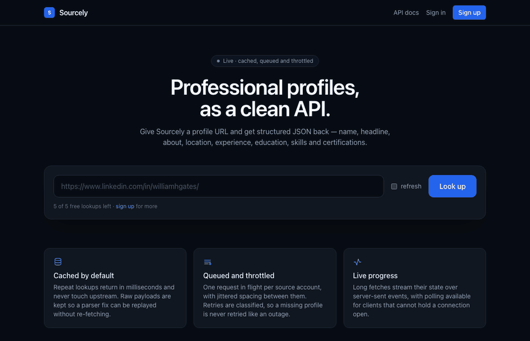
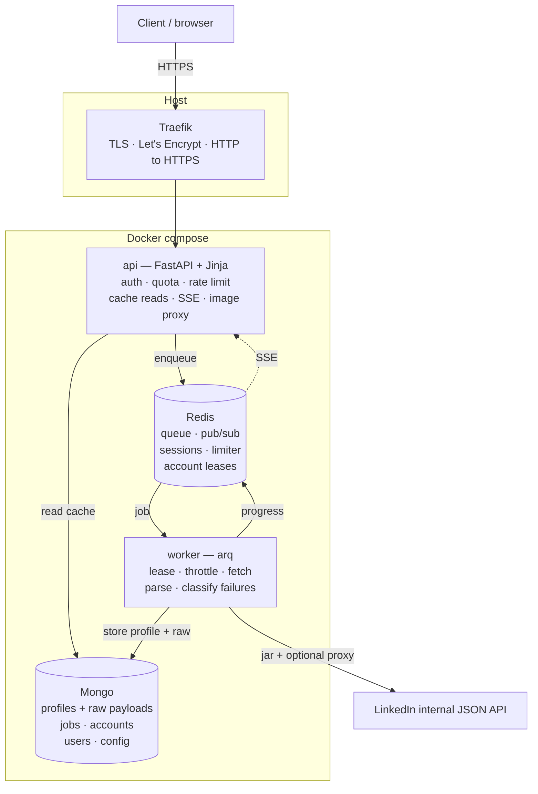
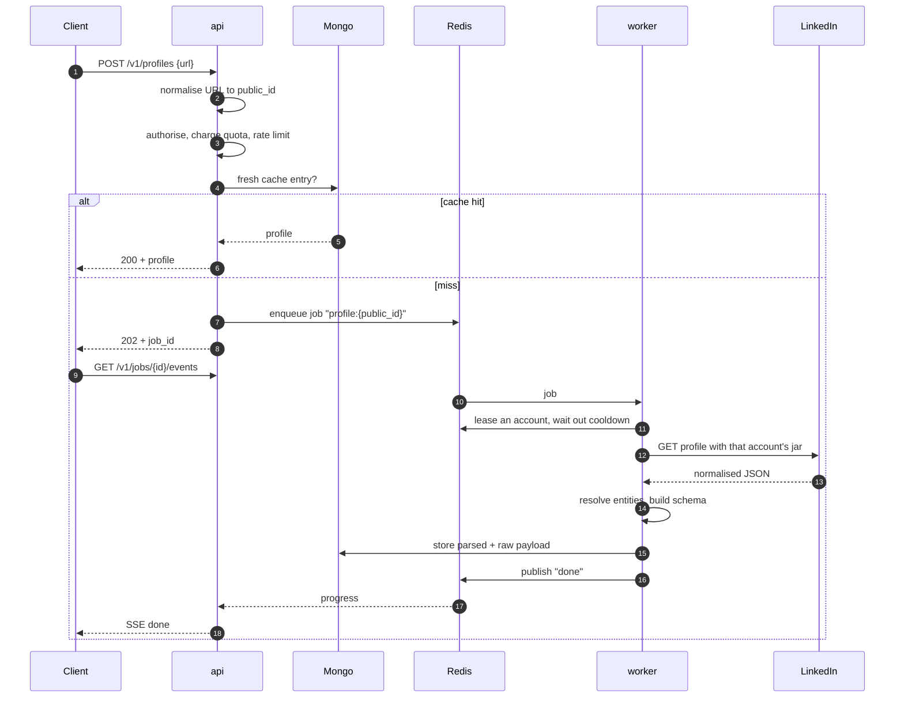
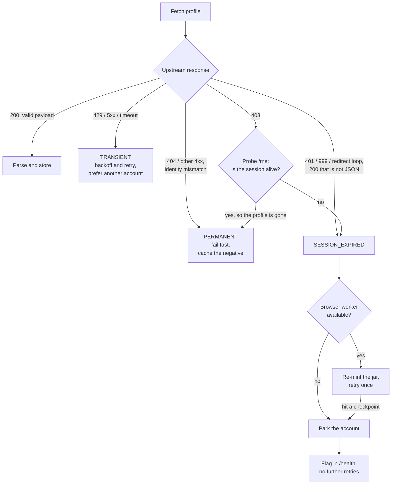
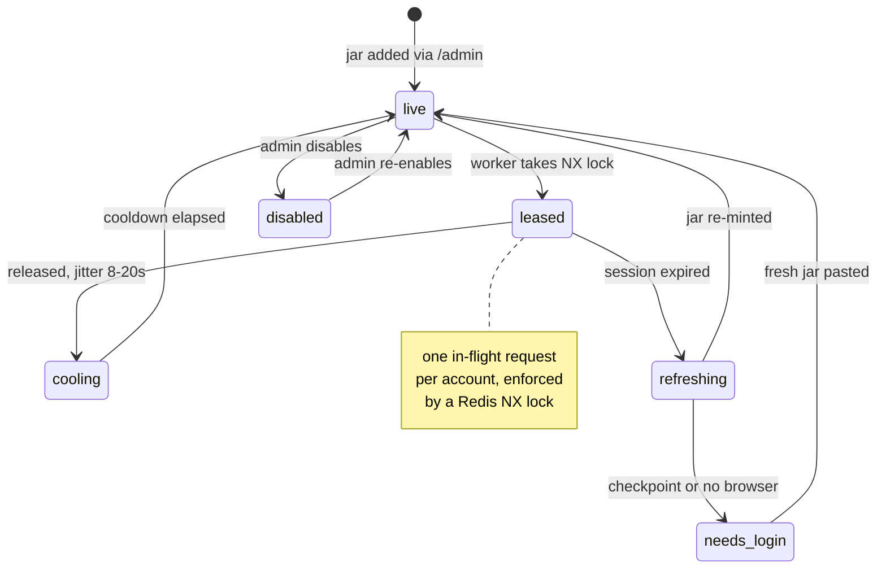
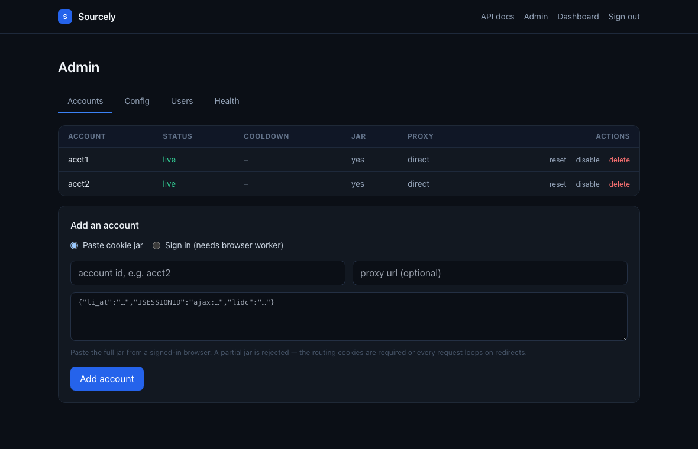
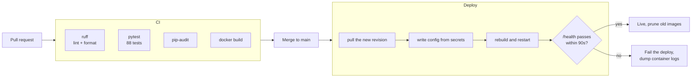

# Sourcely

**Paste a LinkedIn profile URL, get structured JSON back — name, headline, about, location, experience, education, skills, certifications, languages and images.**

A profile API built by reverse engineering the JSON endpoints LinkedIn's own web app calls, wrapped in the things that make undocumented, hostile upstreams survivable: a cache, a job queue, per-account throttling, and a failure taxonomy that knows the difference between "retry this" and "never retry this".

🔗 **Live:** https://sourcely.chiragrai.de &nbsp;·&nbsp; **API docs:** https://sourcely.chiragrai.de/docs &nbsp;·&nbsp; five lookups free, no account needed

[](https://github.com/cro2003/linkedin-profile-viewer/actions/workflows/ci.yml)
[](https://github.com/cro2003/linkedin-profile-viewer/actions/workflows/deploy.yml)
[](https://sourcely.chiragrai.de/)




*A cold lookup with nothing cached, on my own profile: URL in, job queued, live progress
streaming over SSE with the account that served it, then the parsed result — experience,
education, skills and certifications. The footnote at the end is the API admitting it only got
20 of the 40 skills, because LinkedIn hands back one page per collection.*

I deliberately did not build this as a headless-browser scraper. Going after the JSON API
directly means a lookup takes about a second instead of ten, returns already-structured data,
and doesn't need 2 GB of Chromium sitting in the worker image.

---

## Contents

- [Quick start](#quick-start)
- [Response schema](#response-schema)
- [Architecture](#architecture)
- [What a request actually does](#what-a-request-actually-does)
- [Reverse engineering notes](#reverse-engineering-notes)
- [Handling failure](#handling-failure)
- [Account scheduling](#account-scheduling)
- [Running it](#running-it)
- [Configuration](#configuration)
- [API reference](#api-reference)
- [Web UI](#web-ui)
- [Security](#security)
- [Tests](#tests)
- [Deployment](#deployment)
- [Limitations](#limitations)
- [Where I'd take it next](#where-id-take-it-next)
- [Legal](#legal)
- [License](#license)

---

## Quick start

```bash
curl -X POST https://sourcely.chiragrai.de/v1/profiles \
  -H "X-API-Key: sc_your_key" \
  -H "content-type: application/json" \
  -d '{"url":"https://www.linkedin.com/in/williamhgates/"}'
```

Cache hit gives you `200` and the profile. Cache miss gives you `202` and a job:

```json
{
  "job_id": "profile:williamhgates",
  "public_id": "williamhgates",
  "status": "queued",
  "poll_url": "/v1/jobs/profile:williamhgates",
  "events_url": "/v1/jobs/profile:williamhgates/events"
}
```

Poll `poll_url`, or stream it:

```bash
curl -N https://sourcely.chiragrai.de/v1/jobs/profile:williamhgates/events
```

```
data: {"status": "queued", "at": "...", "replay": true}
data: {"status": "fetching", "account_id": "acct1", "attempts": 1}
data: {"status": "parsing"}
data: {"status": "done", "cache_hit": false, "account_id": "acct1"}
data: {"status": "done", "final": true}
```

Five lookups are free without an account. `/signup` gets you an API key and higher limits.

## Response schema

I designed the schema around one assumption: LinkedIn omits things constantly, and a caller
is better off with a profile full of nulls than with an error. So everything except
`public_id` and `url` is optional.

```json
{
  "data": {
    "public_id": "williamhgates",
    "url": "https://www.linkedin.com/in/williamhgates",
    "member_urn": "urn:li:fsd_profile:...",
    "first_name": "Bill",
    "last_name": "Gates",
    "full_name": "Bill Gates",
    "headline": "Chair, Gates Foundation and Founder, Breakthrough Energy",
    "about": "Chair of the Gates Foundation...",
    "location": "Seattle, Washington, United States",
    "country_code": "US",
    "industry": "Philanthropy",
    "profile_picture": "https://media.licdn.com/...",
    "background_picture": "https://media.licdn.com/...",
    "is_premium": true,
    "is_influencer": true,
    "is_creator": true,
    "experience": [
      {
        "title": "Co-chair",
        "company": "Gates Foundation",
        "company_url": "https://www.linkedin.com/company/gates-foundation/",
        "company_logo": "https://media.licdn.com/...",
        "location": null,
        "description": null,
        "employment_type": null,
        "date_range": {"start": {"year": 2000, "month": null, "day": null}, "end": null},
        "is_current": true
      }
    ],
    "education": [
      {
        "school": "Harvard University",
        "school_url": "https://www.linkedin.com/school/harvard-university/",
        "school_logo": "https://media.licdn.com/...",
        "degree": null,
        "field_of_study": null,
        "grade": null,
        "activities": null,
        "description": null,
        "date_range": {"start": {"year": 1973}, "end": {"year": 1975}}
      }
    ],
    "skills": [{"name": "Distributed Systems", "endorsement_count": null}],
    "certifications": [{"name": "...", "authority": "...", "license_number": null, "url": null, "date_range": null}],
    "languages": [{"name": "English", "proficiency": null}]
  },
  "meta": {
    "fetched_at": "2026-08-30T10:11:12+00:00",
    "cache_hit": false,
    "source": "api",
    "schema_version": "1.0",
    "sections": {
      "experience":     {"returned": 3,  "total": 3,  "complete": true},
      "education":      {"returned": 2,  "total": 2,  "complete": true},
      "skills":         {"returned": 20, "total": 40, "complete": false},
      "certifications": {"returned": 13, "total": 13, "complete": true},
      "languages":      {"returned": 0,  "total": 0,  "complete": true}
    },
    "partial_sections": []
  }
}
```

Two calls I'd defend.

**Dates keep their parts.** `{"year": 2000, "month": null}`, not `"2000"` and definitely not
`2000-01-01`. LinkedIn often genuinely doesn't know the month. Inventing January would be
lying to whoever consumes this.

**`meta.sections` tells you what you didn't get.** `returned` is what I parsed, `total` is
what LinkedIn claims exists. Those numbers differ, because the profile endpoint hands back
only the first page of a collection. I found this the annoying way: a profile with 40 skills
was quietly returning 20 and I had no idea. Without this field you cannot tell "this person
listed no certifications" apart from "we only saw page one". `partial_sections` is a
different thing: it lists sections whose *parsing* blew up, so one malformed section
degrades to empty instead of failing the whole profile.

## Architecture



Only the API is routed publicly. The worker, Mongo and Redis stay on the internal network
with no way in from outside.

I split state deliberately. Mongo owns anything durable: profiles, the raw payloads behind
them, jobs, accounts, users, config. Redis owns anything ephemeral: the queue, progress
events, sessions, rate-limit windows, account leases. Cookie jars live in Mongo *only* —
I had them in both for a while and the two stores promptly disagreed about which cookies
were current, which cost me an afternoon.

| Module | Job |
|---|---|
| `app/main.py` | lookup, job status, SSE, health |
| `app/web.py` + `app/templates/` | server-rendered pages, no build step |
| `app/auth.py`, `app/api_auth.py` | sessions, API keys, anonymous quota |
| `app/api_admin.py` | accounts, runtime config, users, stats |
| `app/linkedin/client.py` | HTTP client and failure classification |
| `app/linkedin/parse.py` | payload to schema, pure, no I/O |
| `app/worker.py` | the arq job and retry policy |
| `app/pool.py` | leases, cooldowns, account status |
| `app/accounts.py` | account records and cookie jars |
| `app/session.py` | optional browser cookie re-minting and OTP login |
| `app/store.py` | profile cache and job documents |
| `app/media.py` | first-party image proxy |

## What a request actually does



The job id is `profile:{public_id}`, which means ten simultaneous requests for the same
profile collapse into one fetch instead of stampeding LinkedIn.

I store the raw payload next to the parsed one. That has already paid for itself twice:
when I found a parser bug I could re-parse every cached profile without re-scraping a single
one.

## Reverse engineering notes

Everything below is something that broke, or nearly did. Each one now lives in the code or
in a test.

**Finding the endpoint.** With DevTools open, a profile page fetches
`/voyager/api/graphql` using `queryId` hashes that rotate, which I didn't want to depend on.
Probing the REST surface underneath turned up something stable:
`/identity/dash/profiles?q=memberIdentity&memberIdentity={vanity}&decorationId=...`. It takes
the vanity slug directly, needs no URN lookup first, and returns about 41 KB covering nearly
the whole profile in a single call. The old monolith `/identity/profiles/{id}/profileView` is
`410 Gone`.

**The response is an entity graph, not a document.** You get `{data, meta, included[]}`.
`included[]` is a flat pile of entities keyed by `entityUrn`, and any field named `*foo` is a
URN reference you resolve against that pile. A position points at a company, which carries
the logo and company URL. `parse.py` builds an index and walks it.

**`data.*elements` is the answer; `included` also contains strangers.** This one was nasty.
The decoration also returns related people, the "people also viewed" set. I was taking the
first `Profile` entity out of `included`, which for one profile meant returning a completely
different person — four `Profile` entities came back and the one I asked for was *last*. The
query result is named by `data.*elements`, and that's what I follow now. Had a guard not
been in place, this would have cached one person's data under another person's id and served
it silently. There's a regression test built from that exact payload shape, plus a check that
refuses any response whose `publicIdentifier` doesn't match what was asked for.

**Cookies have to be a jar, not a header.** Minimum auth is `li_at` plus `JSESSIONID`
echoed back as the `csrf-token` header. But LinkedIn's edge also wants routing cookies
(`lidc`, `bcookie`, `bscookie`), and it rotates `lidc` constantly. Pin a static `cookie`
header and you can never echo the rotated value, so you get an **endless 302 to the identical
URL**. It looks exactly like a ban. It isn't one. Two rules came out of that: send the whole
harvested jar, and keep cookies in a jar so `Set-Cookie` updates get picked up and persisted.

**A stale jar is indistinguishable from a ban.** Same redirect loop, plus the browser
bouncing to `/uas/login`. I nearly wrote the account off before noticing the recovery is
trivial: the *second* navigation signs straight back in, because the remember-me cookie
quietly re-mints the session. So a session failure triggers a re-mint and never retires an
account.

**403 means two different things.** LinkedIn returns it both for a profile that doesn't
exist and for a dead session. Retrying the first kind burns accounts on typos. A 403 now
fires a cheap liveness probe at `/me`: session alive means the profile is genuinely gone
(permanent, negatively cached), session dead means rotate to another account.

**Scripted login is a dead end.** The sign-in form has no stable ids. React generates
things like `«Rsvvriejj35659j6»` and ships two copies of the form, so selectors have to match
on input *type*. Even then, submitting credentials from a headless container gets you
`/login/?errorKey=challenge_global_internal_error` or a `/checkpoint/challenge/` page wanting
a verification code. So accounts get onboarded by pasting a cookie jar harvested from a real
browser sign-in, and no password is stored anywhere. Watch the trap in that error URL: the
word "challenge" is in the *query string*, so a naive substring check treats a flat refusal
as a solvable checkpoint and waits ten minutes for a code that will never arrive. I did
exactly that. `is_challenge()` matches on the path only now, and has tests.

**Section availability depends on who's asking.** Skills, certifications and languages come
back in full for profiles the account can see, and as `total: 0` for out-of-network ones.
Nothing about the request changes it; LinkedIn simply doesn't expose that data to that
viewer. I also tried impersonating the Android client, which returns byte-identical coverage,
so that's not a way around it either.

## Handling failure

Retrying the wrong class of error is how scrapers destroy their own accounts, so every
failure gets classified before anything decides to try again.



One detail I'd point at: arq's `max_tries` is set one higher than my own guard, on purpose.
Otherwise arq abandons the job first and the terminal state never gets published, leaving
anyone streaming that job hanging forever.

The cache pulls double duty here. On a transient upstream failure the API serves a **stale**
cached profile rather than erroring. Given how fragile the upstream session turned out to be,
that's the difference between degrading and going down.

## Account scheduling

Parallel requests on a single account is what gets an account flagged, so accounts are
leased one at a time with a jittered cooldown between uses.



`needs_login` and `disabled` accounts get skipped by the scheduler and shown in `/health`,
so a broken account is visible rather than silently eating jobs. In production I've watched
two concurrent lookups land on separate accounts 45 ms apart, each then cooling
independently, which is exactly what this is for.

## Running it

You need Docker and a LinkedIn account you don't mind using.

```bash
git clone https://github.com/cro2003/linkedin-profile-viewer.git
cd linkedin-profile-viewer
cp .env.example .env          # set API_KEYS, SUPERADMIN_EMAIL, SUPERADMIN_PASSWORD
docker compose up -d --build
```

It comes up on http://localhost:8000 with zero LinkedIn accounts, because accounts aren't
configuration. Add one:

1. Sign in at `/admin` with the superadmin credentials from your `.env`.
2. **Accounts → Paste cookie jar.** In a browser where you're signed in to LinkedIn, open
   DevTools and go to **Application → Cookies → `https://www.linkedin.com`**. Copy the
   values of `li_at`, `JSESSIONID`, `lidc`, `bcookie` and `bscookie` into JSON and paste it
   in:

   ```json
   {"li_at": "...", "JSESSIONID": "ajax:...", "lidc": "...", "bcookie": "...", "bscookie": "..."}
   ```

   `JSESSIONID` keeps its `ajax:` prefix; drop the surrounding quotes DevTools shows. A jar
   without `li_at` or `JSESSIONID` is rejected outright, and leaving out the routing cookies
   makes every request loop on redirects for the reasons above.

The panel can also sign an account in for you, given an email and password, and will prompt
for a verification code if LinkedIn asks for one. That path needs the browser worker below,
and LinkedIn often refuses scripted logins outright, so pasting a jar is the reliable route.

### Optional browser worker

By default the worker has no browser and a stale jar has to be re-pasted. If you want
automatic re-minting and sign-in-based account creation with OTP relay:

```bash
docker compose -f docker-compose.yml -f docker-compose.browser.yml up -d --build
```

That pulls a ~2.2 GB Playwright image, so check `df -h` first. Keep it to one replica: an
OTP login holds a browser open inside a single job, and the admin panel has to reach that
same process to hand the code over.

## Configuration

Everything's environment-driven, see `.env.example`. LinkedIn accounts are pointedly *not*
here. They live in Mongo and are managed from the panel, so no LinkedIn credential ever has
to reach an env file or a secret store.

| Variable | Default | What it does |
|---|---|---|
| `API_KEYS` | — | comma-separated keys for tooling; user keys are issued at signup |
| `SUPERADMIN_EMAIL` / `SUPERADMIN_PASSWORD` | — | seeds the superadmin on first boot |
| `MONGO_URL` / `MONGO_DB` / `REDIS_URL` | compose defaults | dependencies |
| `CACHE_TTL_HOURS` | `24` | how long a profile serves from cache |
| `NEGATIVE_CACHE_TTL_HOURS` | `1` | how long a definitive failure is remembered |
| `ACCOUNT_MIN_DELAY_SEC` / `ACCOUNT_MAX_DELAY_SEC` | `8` / `20` | jittered per-account cooldown |
| `RATE_LIMIT_WRITE_PER_MIN` / `RATE_LIMIT_READ_PER_MIN` | `10` / `60` | inbound limits per caller |
| `ANON_FREE_LOOKUPS` / `ANON_IP_LOOKUPS` | `5` / `15` | free tier, per browser and per IP |
| `SESSION_TTL_DAYS` | `7` | session lifetime |
| `COOKIE_SECURE` | `false` | true once you're behind HTTPS |
| `TRUST_PROXY_HEADERS` | `false` | only true behind a proxy you control, see [Security](#security) |
| `FORWARDED_ALLOW_IPS` | — | uvicorn's trust setting for `X-Forwarded-Proto`, set by the Traefik overlay |
| `PROXY_REQUIRED` | `false` | when false, a dead outbound proxy falls back to direct |
| `SSE_MAX_DURATION_SEC` | `300` | hard cap on a stream |
| `OTP_WAIT_SEC` | `600` | how long a login waits for a verification code |

Limits, cooldowns and TTLs are also editable live from **Admin → Config**, which overrides
the environment without a redeploy. The worker picks changes up on its next job.

## API reference

Auth is optional on lookups. A session cookie or `X-API-Key` raises your limits; anonymous
callers get `ANON_FREE_LOOKUPS` free.

### Lookup

| Method | Path | Notes |
|---|---|---|
| `POST` | `/v1/profiles` | `{"url": "...", "refresh": false}` → `200` with the profile or `202` with a job |
| `GET` | `/v1/profiles/{public_id}` | cache-only read, `allow_stale=true` by default |
| `GET` | `/v1/jobs/{job_id}` | status, attempts, event history, error |
| `GET` | `/v1/jobs/{job_id}/events` | SSE; stored events replay first, then live, 15s heartbeat |
| `GET` | `/v1/quota` | remaining free lookups |
| `GET` | `/v1/media?u=...` | image proxy, allowlisted to LinkedIn's CDN |
| `GET` | `/health` | dependencies and per-account status |

### Accounts and keys

| Method | Path | Notes |
|---|---|---|
| `POST` | `/v1/auth/signup` | returns the API key **once** |
| `POST` | `/v1/auth/login`, `/v1/auth/logout` | session cookie |
| `GET` | `/v1/me` | profile, role, usage, key prefix |
| `POST` | `/v1/me/api-key` | rotate; the old key stops working immediately |

### Admin, superadmin only

| Method | Path | Notes |
|---|---|---|
| `GET` `POST` | `/v1/admin/accounts` | list with live status; add via `mode=cookies` or `mode=login` |
| `PATCH` `DELETE` | `/v1/admin/accounts/{account_id}` | disable, set proxy, clear cooldown, reset status, remove |
| `GET` | `/v1/admin/logins/{login_id}` | `running` / `awaiting_otp` / `done` / `failed` |
| `POST` | `/v1/admin/logins/{login_id}/otp` | relay a verification code |
| `GET` `PATCH` | `/v1/admin/config` | runtime configuration |
| `GET` | `/v1/admin/users` | list users |
| `PATCH` | `/v1/admin/users/{user_id}` | disable or change role; refuses self-lockout |
| `GET` | `/v1/admin/stats`, `/v1/stats` | counters and per-account health |

### Errors

One shape everywhere:

```json
{"error": {"code": "rate_limited", "message": "10 requests per 60s exceeded", "retryable": true, "retry_after": 38}}
```

| HTTP | Code | Meaning |
|---|---|---|
| 401 | `unauthorized`, `login_required` | missing or bad credentials |
| 402 | `signup_required` | free lookups used up |
| 403 | `forbidden` | superadmin only |
| 404 | `profile_not_found` | doesn't exist, or not visible to any of my accounts |
| 404 | `profile_identity_mismatch` | upstream answered with a different person, so I refused it |
| 404 | `not_cached`, `job_not_found` | nothing stored under that id |
| 422 | `invalid_url` | not a personal profile URL |
| 429 | `rate_limited` | comes with `Retry-After` |
| 503 | `upstream_unavailable` | transient, retry |
| 503 | `no_accounts` | no LinkedIn account configured yet |
| — | `account_needs_login`, `account_needs_cookies` | an account wants human attention, see `/health` |

## Web UI

| Route | What's there |
|---|---|
| `/` | landing page and a live lookup with streaming progress |
| `/signup`, `/login` | account creation and sign-in |
| `/dashboard` | API key, usage, write limit, copy-paste curl |
| `/admin` | tabs for Accounts, Config, Users, Health |
| `/docs` | OpenAPI reference |

Jinja templates, Tailwind from CDN, vanilla `EventSource`. No build step and no node
toolchain, which for five pages was the right trade.



*Accounts tab: live status, cooldown, whether a jar is present, and whether the account egresses
through a proxy. Adding an account is a paste, not a password.*

## Security

Nothing sensitive has ever been committed. No `.env`, no cookie jars, no captured payloads,
no proxy lists. I check the full history for that, not just the working tree.

| Concern | What I did |
|---|---|
| LinkedIn passwords | never persisted; used once for an optional login then dropped, only cookies are kept |
| User passwords | `hashlib.scrypt`, per-user salt, interactive-cost parameters |
| API keys | stored as SHA-256 hashes, plaintext shown once at creation. A DB leak yields no working keys |
| Sessions | opaque tokens in Redis with a TTL, `httpOnly` cookies, revocable server-side |
| Login enumeration | wrong email and wrong password return byte-identical responses |
| Privilege escalation | runtime config is an allowlist, so `SUPERADMIN_PASSWORD` can't be written through it; an admin can't disable or demote themselves |
| Rate-limit evasion | `X-Forwarded-For` is trusted **only** when `TRUST_PROXY_HEADERS=true`, which the Traefik overlay sets because Traefik is the one setting the header. Without a trusted proxy in front, any caller could forge it and reset their own quota |
| Free-tier evasion | quota counts per browser cookie *and* per IP, so clearing cookies doesn't reset it, while a shared office NAT isn't punished for it either |
| SSRF via the image proxy | exact-match host allowlist, HTTPS only, `image/*` only, 8 MB cap. Tested against cloud metadata, loopback, internal service names and lookalikes like `media.licdn.com.evil.com` |
| Data store exposure | Mongo and Redis sit on an internal Docker network with no published ports |

## Tests

88 tests, no Mongo, Redis, browser or network needed. They run offline in under a second.

```bash
pip install -r requirements.txt
pytest tests/ -q
```

I wrote them against the things that actually broke, not for a coverage number:

| Area | What's asserted |
|---|---|
| URL normalisation | every spelling collapses to one id; company, school and post URLs rejected |
| Parsing | the queried profile wins over a "people also viewed" bystander; truncation is reported; current roles sort first; a sparse profile doesn't error |
| Failure classification | 403 is permanent when the session is alive and rotates when it's dead; transient vs terminal |
| Cookie handling | a persisted jar keeps its seeded cookies (a domain filter once wiped the session outright); a partial jar is refused |
| Account pool | one in-flight request per account; cooldown enforced; unusable accounts skipped; leasing preserves every field |
| Auth | scrypt round-trip, per-user salts, key hashing, quota arithmetic including the IP path |
| Rate limiting | `X-Forwarded-For` ignored unless explicitly trusted |
| Image proxy | seven SSRF rejection cases |
| Login URLs | a refusal URL with "challenge" in its query string is not a checkpoint |

Real captured payloads live in gitignored `fixtures/raw/`. The parser tests skip cleanly when
they're absent so a fresh clone stays green.

## Deployment

It runs anywhere Docker does:

```bash
docker compose up -d --build
```

For anything public, put it behind a reverse proxy that terminates TLS.
`docker-compose.traefik.yml` is an overlay for a Traefik setup: it publishes only the API,
sets `COOKIE_SECURE`, `TRUST_PROXY_HEADERS` and `FORWARDED_ALLOW_IPS`, and keeps the worker,
Mongo and Redis on the internal network with no route in from outside.



The health gate matters more than it looks. `compose up -d` exiting zero tells you a
container started, not that the app works. Without that gate a broken build deploys
"successfully" and you find out from a user instead of from CI.

## Limitations

Being straight about these, since most are LinkedIn's behaviour rather than something I can
fix.

1. **Collections only return their first page.** 40 skills gets you 20. The response says so
   (`{"returned": 20, "total": 40, "complete": false}`) instead of pretending 20 is the lot.
   Paginating needs a per-collection endpoint; the obvious candidates return `400` or redirect
   endlessly, so it's unsolved.
2. **Out-of-network profiles withhold skills, certifications and languages.** They arrive as
   `total: 0`. Nothing in the request changes that. More accounts with wider networks would
   improve coverage; a headless browser wouldn't, since the data isn't shown to that viewer at
   all.
3. **Cookie jars go stale, and refreshing is manual by default.** You get
   `account_needs_cookies`, the account is parked and flagged in `/health`, and you paste a
   fresh jar. Automatic re-minting needs the browser worker and a profile that has signed in
   successfully at least once.
4. **Scripted login gets refused.** Credentials submit fine and then hit a generic refusal or
   a verification checkpoint, so onboarding an account is a deliberate human step.
5. **OTP account creation needs a single worker replica**, because the browser stays open
   inside one job while it waits for the code.
6. **Image URLs are signed and expire**, so a long-cached profile can carry dead links. The
   UI falls back to placeholders and says why; the API returns the URL as given.
7. **LinkedIn's CDN is on tracker blocklists**, so browser extensions block profile images
   outright. `/v1/media` sidesteps that by serving them first-party.
8. **The endpoint is undocumented.** I avoided the `queryId` GraphQL calls because their
   hashes rotate, and the REST endpoint I use has been stable so far, but it could change
   without warning.
9. **Tailwind runs from CDN.** Fine here, would be a build step in anything long-lived.
10. **No bulk endpoint and no pagination.** One profile per request.
11. **Single instance.** Mongo and Redis are unreplicated, so the box is a single point of
    failure.

## Where I'd take it next

The thing to understand first: **throughput is bounded by accounts, not by the app.** With an
8 to 20 second jittered cooldown each account sustains roughly 3 to 7 lookups a minute, and
accounts run in parallel, so capacity is about `accounts × 5/min` with the cache absorbing
repeats on top. Scaling reads is easy. Scaling *fetches* means more accounts, which is a
supply and risk problem rather than an engineering one.

Ordered by value per unit of effort:

1. **Horizontal workers.** Queue, leases and cooldowns already live in Redis, so extra worker
   containers need no code change. Only the OTP flow wants a single replica, and that could
   move to its own queue.
2. **Priority queues.** Keep interactive lookups off the same lane as bulk backfills so a big
   job can't starve someone waiting on a page.
3. **Bulk endpoint with a callback.** `POST /v1/profiles/batch` over many URLs with a webhook
   on completion. The job model already supports it.
4. **Account health scoring.** Track success rate, 429s and session lifetime per account,
   bias leasing toward healthy ones and retire failing ones automatically instead of waiting
   for someone to notice.
5. **Residential proxies, one sticky IP per account.** Per-account proxy support exists; what's
   missing is sticky assignment so an account always egresses from the same address.
   Datacenter IPs are a liability here, not an asset.
6. **Images into object storage.** Fetch once, push to S3 or R2 behind a CDN, return my own
   permanent URLs. Kills both the expiry problem and the blocklist problem, and takes proxy
   bandwidth off the API.
7. **Replicated data stores.** Mongo replica set, Redis with persistence and failover.
8. **Prometheus and tracing.** Redis counters and `/v1/stats` are enough to see what's
   happening, not enough to alert on it.
9. **Schema versioning on the cache.** `schema_version` is already stored, so a background
   re-parse of stored raw payloads would let the schema evolve without re-scraping anything.
10. **Per-tenant quotas and billing.** Users, keys and per-key limits exist; plans, usage
    aggregation and invoicing don't.

Two things I deliberately wouldn't do. A headless-browser fetch path costs roughly 10× the
time and 2 GB of image for data the JSON endpoint already returns, and it doesn't unlock the
out-of-network fields anyway. And caching harder than 24 hours trades correctness for a cost
the current hit rate doesn't justify.

## Legal

I built this for educational and learning purposes: I wanted to understand how LinkedIn's own
client talks to its backend, and what it takes to wrap something undocumented and hostile in
an API that behaves itself.

It calls internal endpoints using a signed-in account's cookies, which is contrary to
LinkedIn's User Agreement, and the accounts involved carry a real risk of restriction. Don't
point it at LinkedIn at scale or commercially without a proper legal basis. Personal data it
returns falls under GDPR and similar regimes regardless of how it was obtained.

## License

Source-available under a personal, non-commercial license: read it, run it, learn from it,
modify it for yourself. Redistribution, hosting it as a service, and commercial or
enterprise use all need my written permission. See [LICENSE](LICENSE).

I chose that over something permissive on purpose. Handing out an MIT licence for code that
calls a third party's internal endpoints would invite people to build a business on it, and
the terms of use it depends on are not mine to grant.
